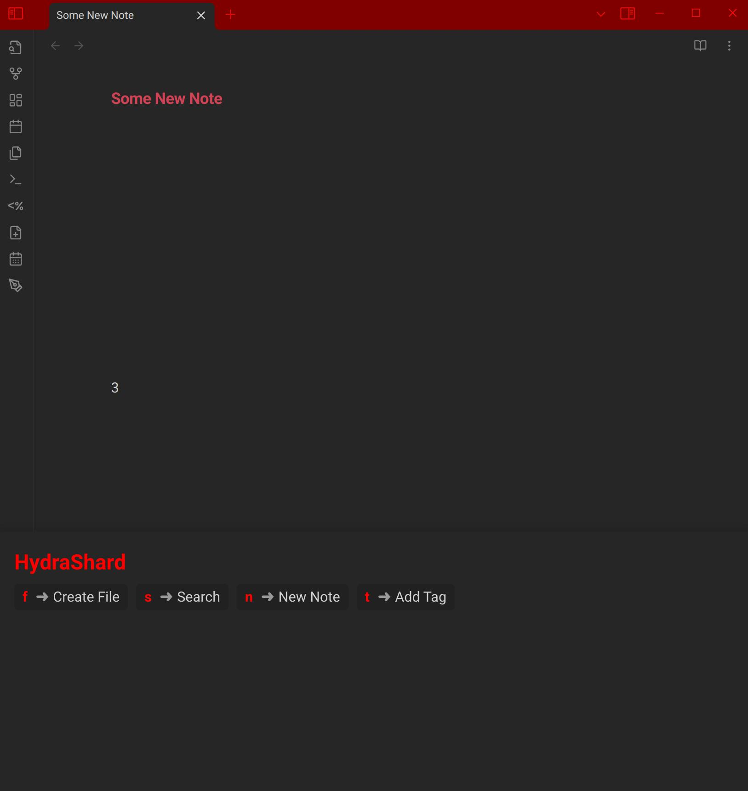

You can read a longer [write up on my blog](https://www.ylanallouche.xyz/posts/whichkey-hydra-obsidian/).
# HydraShard
HydraShard is a [Which-key for Neovim](https://github.com/folke/which-key.nvim)/[Hydra for Emacs](https://github.com/abo-abo/hydra) replacement for Obsidian



# Installation
Simply make available the hydra.js script available in your [Templater user script](https://silentvoid13.github.io/Templater/user-functions/script-user-functions.html) folder.  
# Usage

After that you can simply call it with:

```js
tp.user.hydra(menuitems)
```

Where `menuitems` is an objct of the following shape

```js
  let menuitems = [
    {
      key: "f",
      name: "Name to be displayed here",
      action: async () => {
          let var = await tp.user.someModule();
          return var;
      },
    },
{...}
  ]
```

You need to pass the `tp` object in order to access other user scripts.  

`HydraShard` captures the return value of the triggered function so you can define your behavior both in and out of `menuitems`.

```js
let result = tp.user.hydra(menuitems)
let capturedOutput = result.result
// Do anythign with capturedOutput here
```

There are several strategy depending on how you want to split your code and how much you want to re-use your functions, look at the examples folder.

